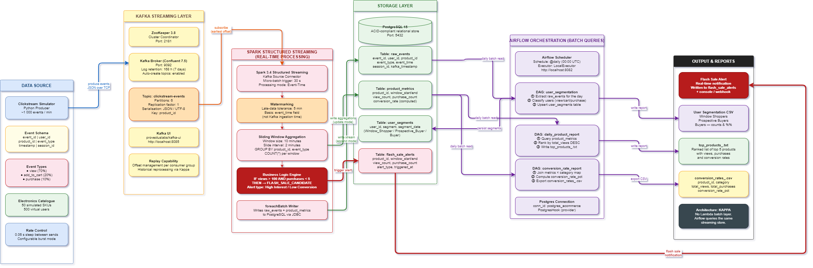

# E-Commerce Clickstream & Inventory Watch Pipeline

A production-grade real-time data pipeline built on the **Kappa Architecture** for an online electronics store. The system ingests clickstream events, processes them with sliding-window aggregations, triggers dynamic pricing recommendations, and generates daily analytics through an orchestrated batch layer.

---

## Architecture



```
Clickstream Simulator ──► Kafka ──► Spark Structured Streaming ──► PostgreSQL
                                          │                              │
                                          ▼                              ▼
                                   Flash Sale Trigger           Apache Airflow
                                   (> 100 views, < 5 purchases)      │
                                                               ┌──────┴──────┐
                                                               ▼             ▼
                                                      User Segmentation  Daily Reports
                                                      (Window Shoppers   (Top-5 Products,
                                                        vs Buyers)        Conversion Rates)
```

**Architecture Pattern:** Kappa — a single unified stream-processing layer eliminates the dual-layer complexity of Lambda. Airflow orchestrates periodic queries against the live storage layer rather than maintaining a separate batch computation path.

---

## Technology Stack

| Component | Technology | Version |
|-----------|-----------|---------|
| Message Broker | Apache Kafka | 7.5.0 (Confluent) |
| Stream Processor | Apache Spark Structured Streaming | 3.4.1 |
| Orchestration | Apache Airflow | 2.8.1 |
| Dashboarding | Grafana | 10.2.3 |
| Storage | PostgreSQL | 15 |
| Producer | Python (kafka-python) | 3.11 |
| Infrastructure | Docker Compose | v3.8 |

---

## Repository Structure

```
pipeline/
├── architecture/
│   ├── kappa_architecture.drawio        # Architecture diagram source (draw.io)
│   └── kappa_architecture.drawio.png    # Exported architecture diagram
├── config/
│   ├── kafka_config.py                  # Kafka connection constants
│   ├── spark_config.py                  # Spark job configuration
│   └── init_db.sql                      # PostgreSQL schema initialisation
├── producer/
│   ├── clickstream_producer.py          # Kafka event simulator
│   └── requirements.txt
├── spark/
│   ├── streaming_job.py                 # Main Spark Streaming job
│   ├── flash_sale_trigger.py            # Flash sale detection & alert dispatcher
│   └── requirements.txt
├── airflow/
│   ├── dags/
│   │   ├── user_segmentation_dag.py     # Daily user segmentation DAG
│   │   └── daily_report_dag.py          # Daily top-5 products report DAG
│   └── requirements.txt
├── grafana/
│   ├── dashboards/
│   │   └── clickstream_dashboard.json   # Auto-provisioned Grafana dashboard
│   └── provisioning/
│       ├── dashboards/
│       │   └── dashboards.yaml
│       └── datasources/
│           └── postgresql.yaml
├── reports/
│   ├── conversion_rate_report.py        # Conversion rate analytics generator
│   └── output/                          # Generated report artefacts
├── docs/
│   └── project_report.md               # 1 500-word project report
├── docker-compose.yml                   # Full stack orchestration
└── README.md
```

---

## Prerequisites

- Docker Desktop ≥ 24.0
- Docker Compose ≥ 2.20
- Python 3.11 (for local development outside Docker)

---

## Quick Start

### 1. Start the full stack

```bash
docker compose up -d
```

Services exposed:

| Service | URL |
|---------|-----|
| Spark Master UI | http://localhost:8080 |
| Airflow Webserver | http://localhost:8081 (admin / admin) |
| Grafana Dashboard | http://localhost:3000 (admin / admin) |
| PostgreSQL | localhost:5432 |

### 2. Run the clickstream producer

```bash
cd producer
pip install -r requirements.txt
python clickstream_producer.py
```

### 3. Submit the Spark Streaming job

```bash
docker exec spark-master spark-submit \
  --packages org.apache.spark:spark-sql-kafka-0-10_2.12:3.4.1,org.postgresql:postgresql:42.6.0 \
  /opt/spark-jobs/streaming_job.py
```

### 4. Trigger Airflow DAGs

Navigate to http://localhost:8081, enable and manually trigger:
- `user_segmentation`
- `daily_product_report`

### 5. Open the Grafana dashboard

Navigate to http://localhost:3000 and open the auto-provisioned dashboard:
- `E-Commerce Clickstream & Inventory Watch`

### 6. Generate the conversion rate report

```bash
cd reports
pip install -r requirements.txt
python conversion_rate_report.py
```

---

## Business Logic

### Flash Sale Trigger

The Spark Streaming job maintains a **10-minute sliding window** (slide interval: 1 minute) per product. When a product exceeds **100 views** with **fewer than 5 purchases** within that window, an alert record is written to `flash_sale_alerts` and becomes visible in Grafana.

### User Segmentation

Airflow runs `@daily` to classify every active user:

| Segment | Criteria |
|---------|----------|
| `Buyer` | At least one `purchase` event |
| `Window Shopper` | No `purchase` events during the daily interval |

### Conversion Rate

`purchases / views × 100` computed per product and per category across the daily reporting window.

---

## Reports

All generated artefacts land in `reports/output/`:

| File | Description |
|------|-------------|
| `top_products_<date>.txt` | Top 5 most viewed products with conversion rates |
| `conversion_rates_<date>.csv` | Full per-product conversion rate breakdown |

---

## Dashboard

Grafana is provisioned automatically at startup and uses PostgreSQL as its datasource. The dashboard includes:

- real-time product views in 10-minute sliding windows
- event funnel monitoring (views, add-to-cart, purchases)
- flash-sale alert counts and detailed alert log
- daily top-product conversion performance
- buyer vs window-shopper segmentation snapshots

---

## Stopping the Stack

```bash
docker compose down -v
```